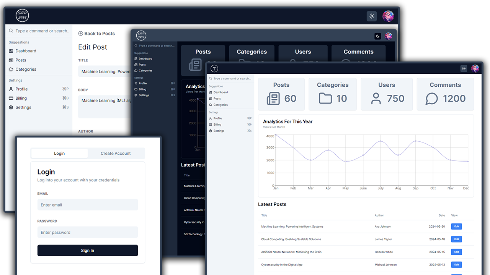

## Admin Dashboard 

### Packages Used

- Next.js/React
- TypeScript
- Shadcn/ui
- Tailwind CSS
- Recharts
- Lucide React
- React Hook Form
- Zod
- Next Themes

## Getting Started

First, run the development server:

```bash
npm run dev
# or
yarn dev
# or
pnpm dev
# or
bun dev
```

Open [http://localhost:3000](http://localhost:3000) with your browser to see the result.




---

##### Contact with me:

[][linkedin]

[linkedin]: https://www.linkedin.com/in/sergiy-antonyuk/

##### I can't express how much I have learned from [you](https://www.youtube.com/@TraversyMedia) ! <br> Thanks for the hard and smart work.
